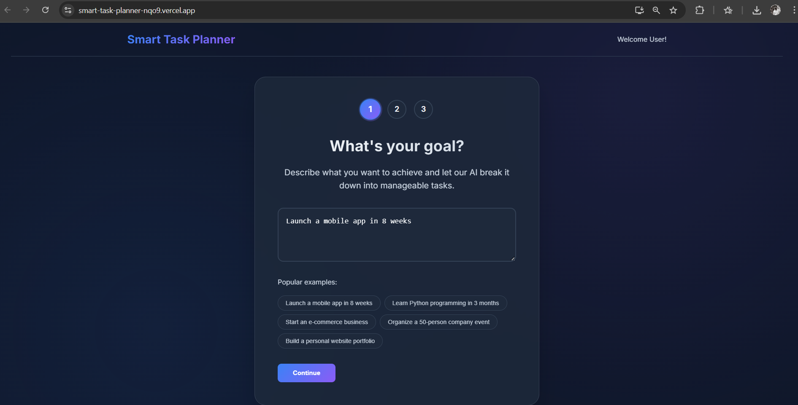
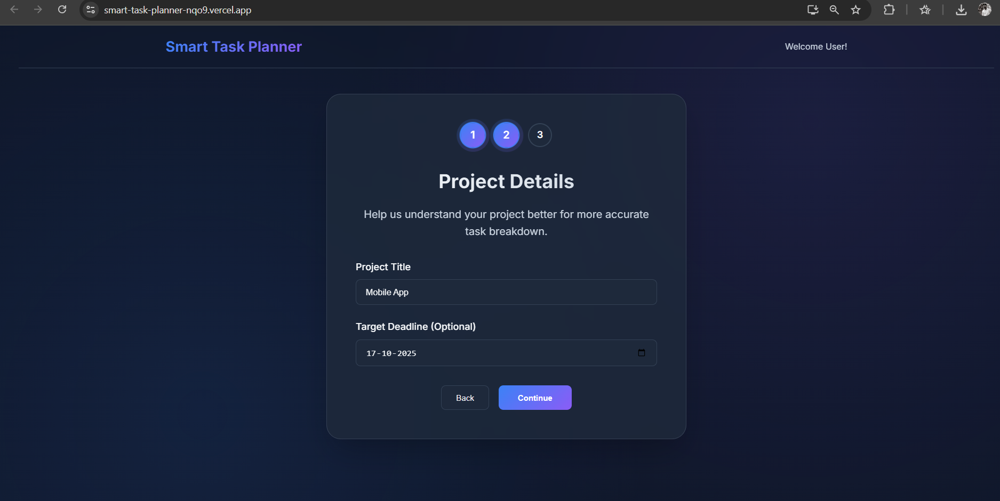
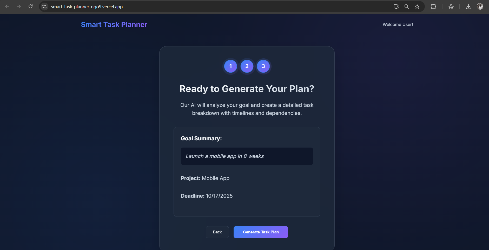
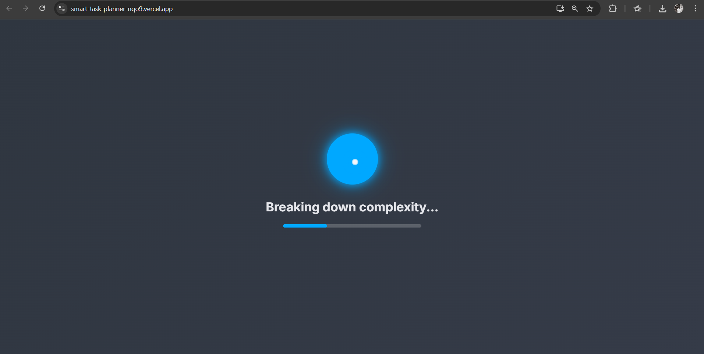
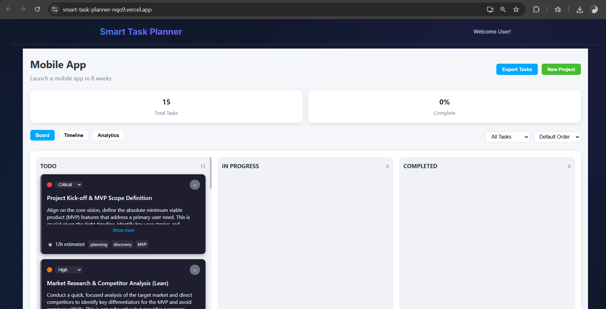
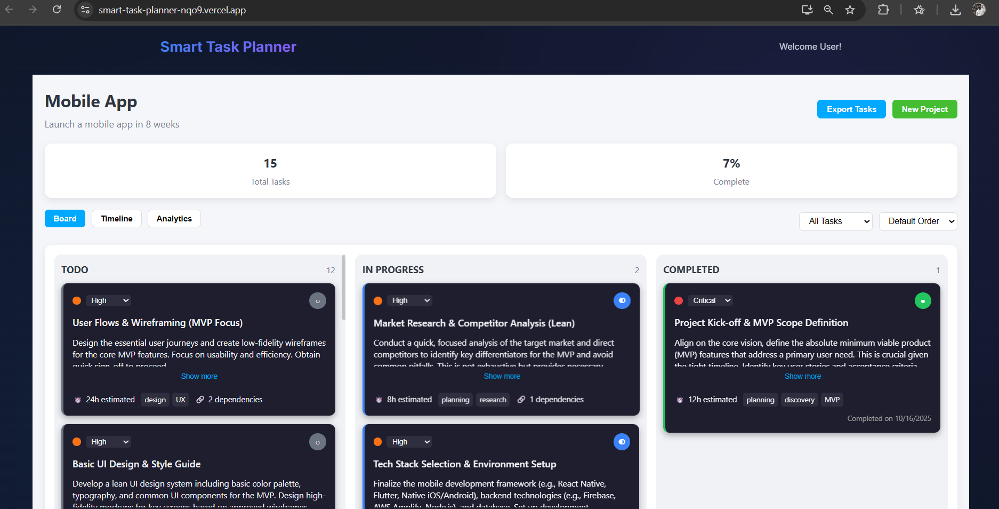

# Smart Task Planner

Smart Task Planner is an AI-powered project management tool that automatically breaks down your goals into actionable tasks, prioritizes your workflow, and assists with deadlines, progress tracking, and dependencies. This full-stack web application is built with React, Node.js, MongoDB, and intelligent AI integration.

---

## 🚀 Live Demo & Demo Video

- 🌐 **Live Application:** [https://smart-task-planner-nqo9.vercel.app/](https://smart-task-planner-nqo9.vercel.app/)
- 🎬 **Demo Video:** [Watch on Google Drive](https://drive.google.com/file/d/1v6BS0_Nin-qlUzMCYqgF0TzvSTa7pAiX/view?usp=sharing)

---


## ✨ Features

- 🤖 AI-based goal analysis and task breakdown  
- ⏱️ Task prioritization and deadline suggestions  
- 📊 Progress tracking with charts  
- 🔗 Dependency management among tasks  
- 🔒 User authentication and authorization  
- 📱 Responsive and intuitive user interface  

---

## 🖼️ Screenshots

### Landing Page





### Loading Screen


### Task Timeline



### Task Progress Chart



---

## 🛠️ Tech Stack

-  **Frontend:** React, Axios, Chart.js  
-  **Backend:** Node.js, Express.js  
-  **Database:** MongoDB, Mongoose  
- 🌟 **AI Integration:** Gemini API / OpenAI API  
- 🔑 **Authentication:** JWT Tokens  
- 🚀 **Deployment:** Vercel (frontend), Render (backend)  

---

## 🏁 Installation & Configuration

### Prerequisites

- Node.js v16+  
- MongoDB Atlas account or local MongoDB server  
- Gemini or OpenAI API key  

### 1. Clone the repository

```bash
git clone https://github.com/vamsichinta7/smart-task-planner.git
cd smart-task-planner
```

---

### 2. Backend Setup

```bash
cd backend
npm install
```

Create a `.env` file in `/backend` with:

```env
PORT=3001
MONGODB_URI=your_mongodb_connection_string
JWT_SECRET=your_jwt_secret
GEMINI_API_KEY=your_gemini_api_key
CORS_ORIGIN=http://localhost:3002
```

Start backend:

```bash
npm start
```

---

### 3. Frontend Setup

```bash
cd ../frontend
npm install
```

Create a `.env` file in `/frontend` with:

```env
REACT_APP_API_URL=http://localhost:3001
```

Start frontend:

```bash
npm start
```

---

## 🚢 Deployment

### Backend Deployment on Render

1. Create an account on [Render](https://render.com) and connect your GitHub repo.
2. Create a new **Web Service**, selecting the backend folder.
3. Set Build Command: `npm install`
4. Set Start Command: `npm start`
5. Configure environment variables as shown above.
6. Deploy the backend and copy the public web service URL.

### Frontend Deployment on Vercel

1. Sign up at [Vercel](https://vercel.com) and connect your repo.
2. Create a new project, select the frontend folder.
3. In **Settings > Environment Variables**, add
   ```
   REACT_APP_API_URL=https://your-backend-service-url
   ```
   Replace with your Render backend URL.
4. Deploy, then use the Vercel live URL as your frontend's domain.

---

## 🚦 Usage

- Register or log in to your account.
- Input your project goals into the AI-powered goal input form.
- View automatically generated tasks and their dependencies.
- Track progress with charts and the timeline view.
- Adjust task priorities and deadlines as needed.

---

## 🔌 API Endpoints

| Method | Endpoint               | Description                    |
|--------|------------------------|--------------------------------|
| POST   | `/api/auth/register`   | Register a new user           |
| POST   | `/api/auth/login`      | Login and receive JWT         |
| POST   | `/api/ai/analyze-goal` | Analyze goal and generate tasks|
| GET    | `/api/tasks`           | Get all tasks for the user    |
| POST   | `/api/tasks`           | Create a new task             |
| PUT    | `/api/tasks/:id`       | Update task by ID             |
| DELETE | `/api/tasks/:id`       | Delete task by ID             |

---

## ⚙️ Environment Variables

### Backend `.env`

- `PORT` - Server port  
- `MONGODB_URI` - MongoDB connection string  
- `JWT_SECRET` - Secret for JWT  
- `GEMINI_API_KEY` - Gemini/OpenAI key  
- `CORS_ORIGIN` - Allowed frontend domain

### Frontend `.env`

- `REACT_APP_API_URL` - Backend API base URL  

---

## 🙌 Contributing

Contributions are welcome! Please fork the repo and submit a pull request.

---

## 👤 Author

**Vamsi Chinta**

- **GitHub**: [@vamsichinta7](https://github.com/vamsichinta7)

---
